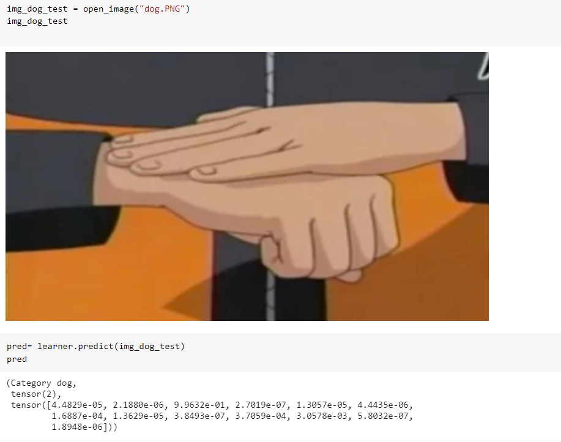
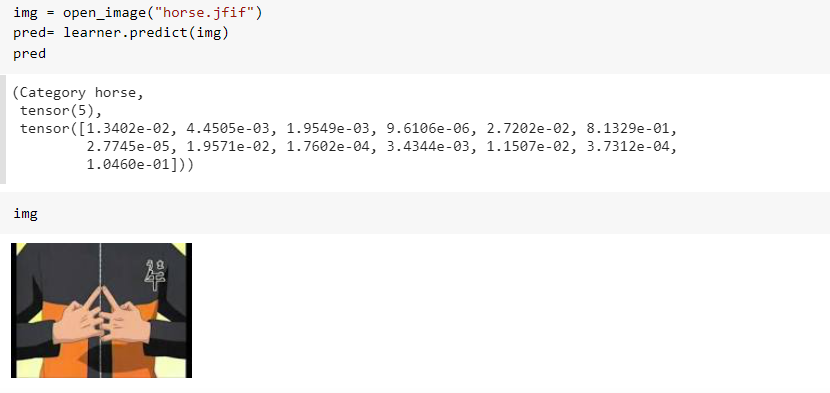
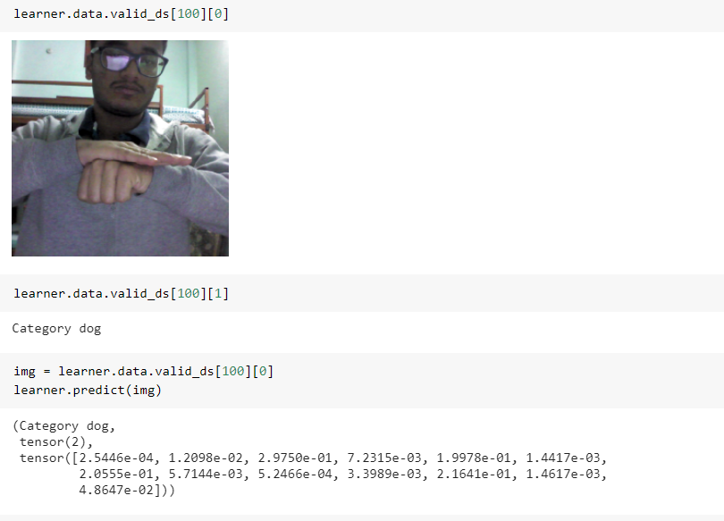

# Instructions

- Naruto Hand sign recognition
- Dataset : https://www.kaggle.com/vikranthkanumuru/naruto-hand-sign-dataset
- There are two models made with resnet18 and resnet50 and the notebooks are labeled as such. Both give very good accuracies, but the 18 seems to be better
- The outputs are below

